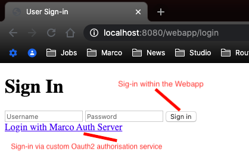

# Springboot & Oauth2 
Oauth2 is a widespread (at the time of writing this) protocol, and it is used to secure the resources.
In this repo I am creating a very simple Springboot projects to learn more about Oauth2 and how I can use it. All the tutorials, guides, youtube videos that I manage to read / watch, are always creating one single Java project and defining all the actors (Client Application, Authorisation Server, Resource Server) in that project, which is fine, but not a real scenario. In the real world usually all those actors are deployed in different places, so they needs to be implemented in different Java projects. This is what I wanted to do here, create different projects for every actor, and understand how to use Springboot + Oauth2.

**Requirements**
- Have a basic understanding of Oauth2 basic concepts (What it is, who are the actors and what are the oauth "flows")
- Java 11
- Maven 3.x

## Web App client
This project provides a simple UI for the browser. The user can navigate to [home page](http://localhost:8080/webapp) and decide how to sign in. The login screen has a simple form, if the user will use this form, he will be authenticated against the "security" logic implemented in the Webapp Client service. Otherwise he can decide to login via the Authorisation Service using Oauth2 and the grant type "authorisation_code".

## Authorisation Service
This service is a Springboot project which allows the user to grant the access to the protected resource (Resource service) to a third party service (Webapp Client service). This service uses the Oauth2 protocol, and generates JWT tokens.

## Resource Service

This service provides a protected API secured using the Oauth2 protocol. If a client wants to access the protected API he needs first to retrieve a JWT token from the Authorisation service.

## Internal Resource Service

This service provides a protected API secured using the Oauth2 protocol. This service will be called by another service, so no user interaction will be required, it is a "service to service" call. The "caller" service needs anyway to retrieve a JWT token from the Authorisation service in order to call the Internal Resource Service.

## Workflow

* **A1** The service retrieves the JWT Public sign key at start-up
* **A2** The service retrieves the JWT Public sign key at start-up
1. The Resource Owner (user) opens the browser and opens the [home page](http://localhost:8080/webapp) of the Webapp
1. The reousrce owner selects the log-in via the authorisation service, the Webbapp redirects the resource owner (user) to the Authorisation service
1. The user logs in as "admin" user 
1. The user authorise the "Webapp" to access his resources stored on the resource server
1. The authorisation service redirect the user to the Webapp client and provides as parameter to the "webapp" the access code
1. The Webbapp receives the access code, and uses this code to retrieve the authorisation token from the Authorisation service (**"Authorisation Code"** grant type)
1. The Webbapp receives the Authorisation token and it makes a call to the Resource service using the authorisation code
1. The Resource Service validates the received Authorisation token using the Authorisation Service public sign key
1. The Resource Service calls the Authorisation service to generate another JWT token to be used in the call to the Internal Resource Service (**"Client Credentials"** grant type)
1. The Authorisation service sends back to the Resource service a new JWT token
1. The Resource service uses the **new** token to call the Internal Resource Service
1. The Internal Resource Service validates the received Authorisation token using the Authorisation Service public sign key
1. The Internal Resource Service sends the reply to the Resource Service
1. The Resource Service sends the reply to the Webapp client 
1. The Webbapp displays the results to the Resource owner (user)

### TODO
 - Customise the JWT token and add some extra claims
 - Read the customised JWT token from the Webapp service
