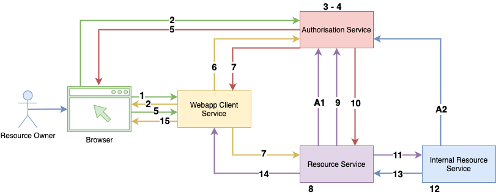

# Springboot Oauth2 playground
In this repo I am creating very simple Springboot projects to learn a more about Oauth2 and how I can use it.

**Current structure of the project**

## Web App client
This project provides a simple UI for the browser. The user can navigate to [home page](http://localhost:8080/webapp) and decide how to sign in.

The login screen has a simple form, if the user will use this form, he will be authenticated against the "security" logic implemented in the Wev App Client service. Otherwise he can decide to login via the Authorisation Service using Oauth2 and the "authorisation code" grant type.

## Authorisation Service
This service is a Springboot project which allows the user to authorise the access to the protected resource (Resource service) to a third party client service (Webapp Client service). This service uses the Oauth2 protocol, and generates JWT tokens.

## Resource Service

This service provides a protected API implementing the Oauth2 protocol. The client wants to access the protected API needs first to retrieve a JWT token from the authorisation service.

### TODO
 - Customise the JWT token and add some extra claims
 - Read the customised JWT token from the Webapp service
